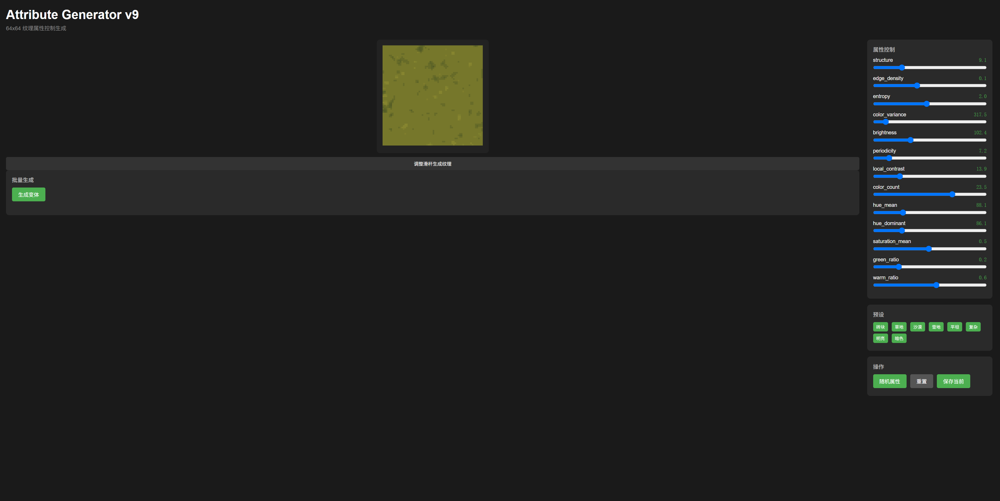
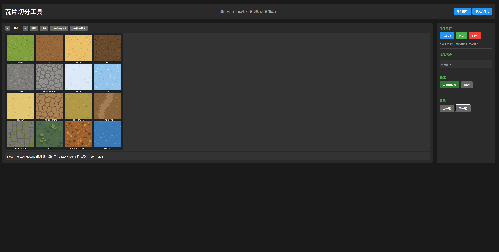
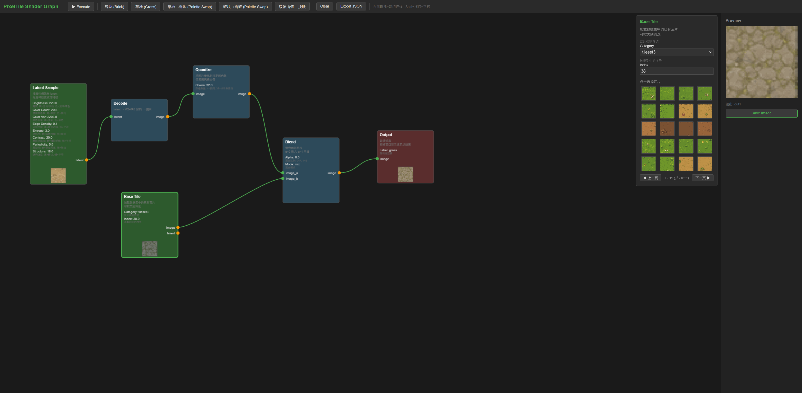

# PixelTileGenerator

基于 VQ-VAE 的 64×64 像素画地形贴图生成系统。

## 功能

- **VQ-VAE 编码/解码**：将像素画贴图压缩到离散 latent space，高质量重建
- **属性控制生成**：通过滑杆控制 structure、entropy、brightness 等 13 个属性生成不同地形
- **调色板换肤**：保留纹理结构，切换草/石/雪/沙/岩浆等颜色风格
- **节点式工作流**：Shader Graph 可视化节点编辑器，组合生成复杂地形贴图

## 演示

### 纹理生成



### 切分工具



### Shader Graph 节点编辑器



## 架构

```
原始 PNG → 颜色量化 → VQ-VAE 编码 → latent space → 属性控制/节点生成 → VQ-VAE 解码 → 64×64 像素画贴图
```

### 模型

| 模型 | 文件 | 说明 |
|---|---|---|
| VQ-VAE v4 | `models/vq_vae_v4.py` | 64×64 双阶段编解码器，1024 码本，codebook reset |
| VQ-VAE v3 | `models/vq_vae_v3.py` | 64×64 基础版 |
| VQ-VAE v2 | `models/vq_vae_v2.py` | 32×32 参考版 |

### 目录结构

```
models/                     # 模型定义
scripts/
  training/                 # 训练脚本
  data/                     # 数据预处理
  tools/                    # 可视化、分析、Web UI
    attribute_generator_v9.py  # 属性控制生成器 (Flask, port 5004)
    texture_browser.py         # 纹理浏览器 (Flask, port 5002)
    shader_graph/              # 节点式编辑器 (Flask, port 5005)
    slicer_tool.py             # 瓦片切分工具 (Flask, port 5001)
palettes/                   # JSON 调色板 (grass, stone, snow, etc.)
```

## 快速开始

### 环境

```bash
pip install torch torchvision pillow numpy flask scikit-learn
```

### 训练 VQ-VAE

```bash
# 量化数据集 (32 色)
python scripts/data/quantize_batch.py

# 训练 VQ-VAE v9 (64×64)
python scripts/training/train_vqvae_v9.py
```

### 提取 latent

```bash
# 提取 z_q 连续向量
python scripts/data/extract_zq_latents_v9.py

# 提取离散 indices
python scripts/data/extract_vqvae_latents_v9.py
```

### 属性控制生成

```bash
# 计算纹理属性 + 聚类
python scripts/tools/texture_attributes_v9.py

# 启动属性控制生成器
python scripts/tools/attribute_generator_v9.py
# 打开 http://localhost:5004
```

### Shader Graph

```bash
python scripts/tools/shader_graph/app.py
# 打开 http://localhost:5005
```

### 其他工具

```bash
python scripts/tools/texture_browser.py    # 纹理浏览器 (port 5002)
python scripts/tools/slicer_tool.py        # 瓦片切分 (port 5001)
python scripts/tools/review_server.py      # 数据集审核 (port 5000)
```

## 数据集

训练数据需要放在 `datasets/classified/pixel_64_quantized/` 目录下，格式为 64×64 RGBA PNG，颜色量化到 32 色。

数据集不在仓库中，需要自行准备。

## 模型参数

预训练模型参数不在仓库中。训练完成后会保存在 `checkpoints/` 目录下：

- `checkpoints/vqvae_v9/vqvae_v9_best.pth` — 最佳 VQ-VAE v9 模型
- `checkpoints/v9_attribute_space/` — 属性空间数据

## 许可

MIT License

## 数据来源

训练数据使用 ChatGPT 生成的像素画贴图，经颜色量化处理。
